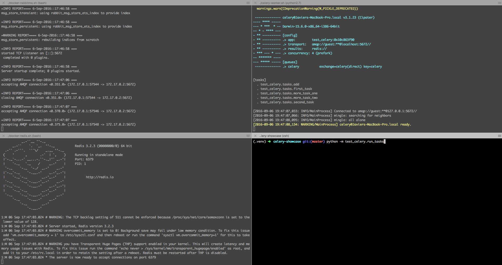
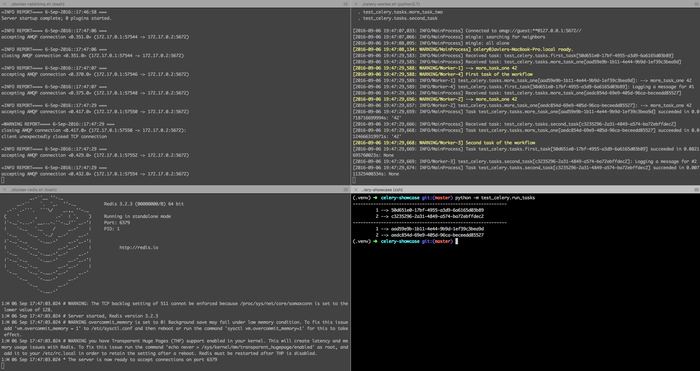

# celery-showcase

To try out `test_celery`, follow this steps:

## Installation:

1. Create a virtualenv `virtualenv .venv`
2. Activate the virtualenv `source .venv/bin/activate`
3. Install the dependencies `pip install -r requirements.txt`

## Run it!

1. Run RabbitMQ `./docker-rabbitmq.sh`
2. In a second terminal, run Redis: `./docker-redis.sh`
3. In a third terminal, activate the virtualenv `source .venv/bin/activate` and run the Celery Worker: `./celery-worker.sh`
4. Open a last terminal, activate the virtualenv `source .venv/bin/activate` and run the tasks `python -m test_celery.run_tasks`

## Screenshots

#### RabbitMQ, Redis and Celery Worker running, no tasks have been scheduled yet:

#### RabbitMQ, Redis and Celery Worker running, tasks are scheduled and executed:

